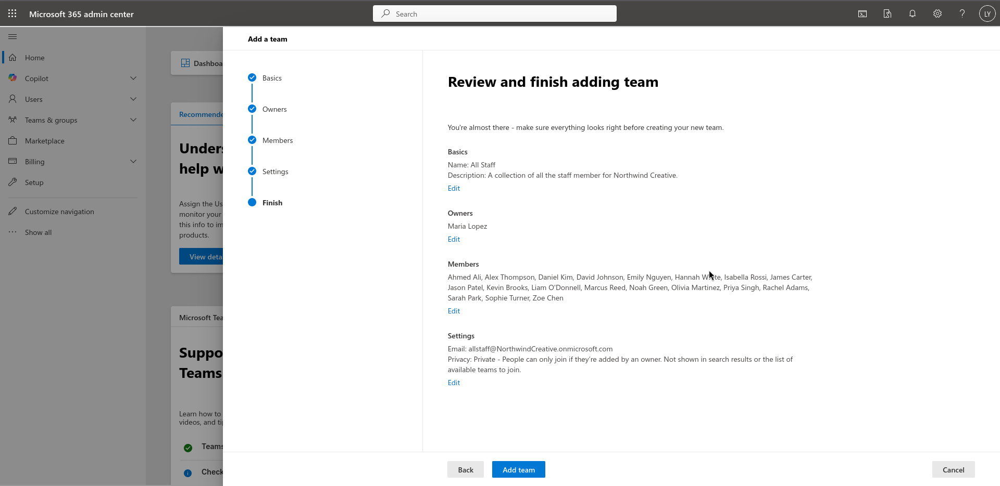
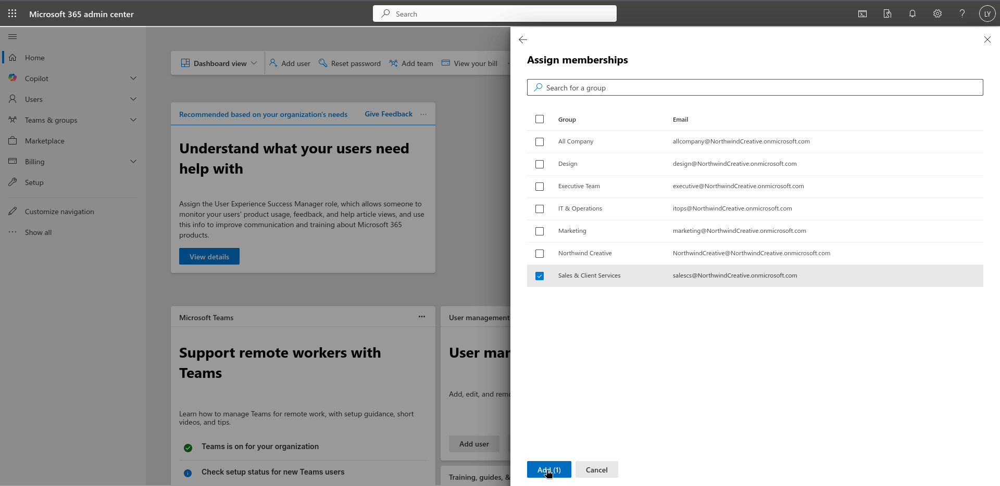
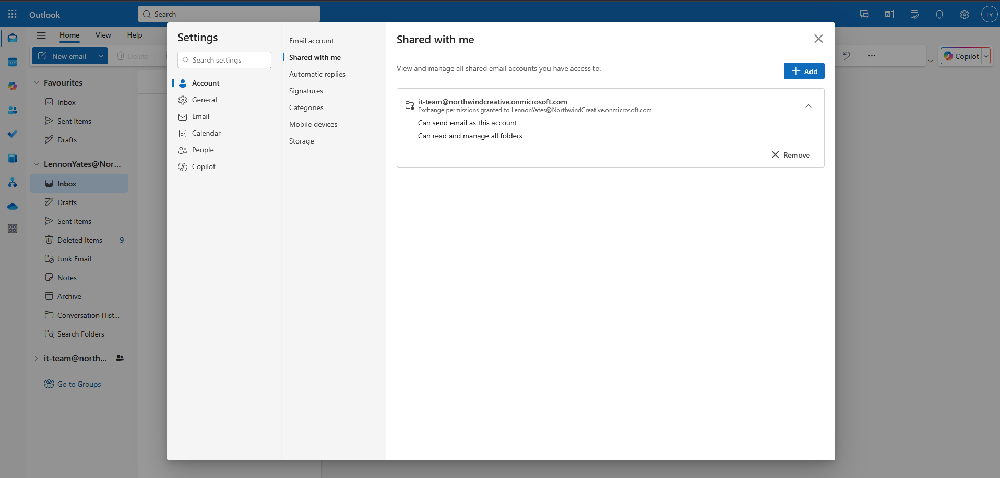

# Microsoft 365 lab write up

## Purpose

In a modern business environment, it is likely that you will come across many cloud tools. These are tools you use that are not hosted on machine on the business premises. As an IT support worker, you will need to be familiar with the management and set-up of these systems. I created this lab to display my ability to perform these tasks.

## Technology used

* Microsoft 365 for business 

This is the technology you will most likely see in a business environment, with many businesses choosing to use the cloud based model. I chose to set-up this lab in the cloud to demonstrate my ability to work with technology I will encounter in real world IT support role. I am also unfamiliar with user creation and management on this platform, and so using it in this lab gave me a chance to learn and refine these skills.

## Creating the users

In order to learn user management on this platform, I need to come up with some users to create. For this task I generated a small business with 20 employees, so I had some accounts to create.

## Adding these user to Microsoft 365

Now I had my users in place, I had to begin creating them in the Microsoft 365 cloud environment. These are the steps I took to create these users:

* Logged in to my M365 admin panel.
* Selected 'Add user'.
* Entered first and last name for user.
* Created user-name.
* Generated password.
* Set to change password on first login.
* Enabled Multifactor Authentication (MFA) for all employees to strengthen account security.

## Creating the teams

Now the user accounts are in place, I needed to create the departments to sort the users into. These are the steps I took:

* Located the 'Add team' section of the admin panel.
* Created the team name, and gave a short description.
* Assigned the department heads as 'Owners' of the team.
* Added employees of a department as 'Members' of the team.
* Finished creation of the team.
* Proceeded to create teams with owners and members for each department.

 

## Performing daily tasks

When you are working in IT support, it is rare you will have to set up an environment, although knowing how to do so will help you with troubleshooting, as you know how the process works from the ground up. I decided to simulate some daily tasks that I would come across in the industry to further my understanding, and learn how to solve common problems for users. Here are the tasks I completed:

* Creating a new user, simulating a new employee joining the business.
* Adding a new employee to an existing team.
* Assigning permissions to an existing user, simulating employee promotion.
* Resetting a users password, simulating forgotten passwords, or difficulty logging in to account.
* Unlocking a user account, simulating a user who has too many failed login attempts, or a users account that has been compromised, and allowing login after the threat has been neutralised.

Ocassionally, a company may use a shared mailbox in order to collectively message many users at once. This is another task that you will see often in IT support work, so I decided to simulate setting up a shared mailbox for my IT team. Here are the steps:

* Log in to the Microsoft 365 admin panel.
* From the left hand menu, select 'Teams & groups'.
* Select 'Shared mailboxes'
* From the shared mailboxes screen, select 'Add a shared mailbox'.
* Enter the name for the mailbox.
* Select the email address for the shared mailbox.
* Select 'Save changes'.
* Select your shared mailbox.
* Under 'Members' select the 'Edit' option.
* Add the relevant member accounts to the group.
* Save your changes.

Now I had created the mailbox, I needed to add it to my Outlook web application. Here are the steps I took:

* Opened Outlook web application.
* Right clicked on my email account.
* Selected the 'Add shared folder or mailbox'.
* Enter the address for the shared mailbox.
* Select 'Continue' to add the mailbox.
* Test the mailbox by sending a short email.

## What I learned from this lab

This lab was incredibly helpful in educating myself in a platform I have not previously used, also proved to be very straightforward, and a lot of fun to build. These are the skills I learnt and developed:

* User creation in Microsoft 365.
* Team creation in Microsoft 365.
* Enabling MFA.
* Resetting Microsoft 365 user passwords.
* Unlocking Microsoft 365 user accounts.
* Defining a users permissions.
* Setting up shared mailboxes.

## Things I would do differently

If I were to recreate this lab again with the skills and experience I have now, there are several things I would change:

* Automating user creation.

*Creating 20 users one by one was incredibly time consuming, and didn't feel very efficient, next time I would make use of the user templates in order to create users quickly.*

* Using bulk import tools

*After I generated the list of employees, I had to then transcribe this into a LibreOffice sheets file, allowing me to reference the data for my users, and create the account. Next time I would look at exporting this information to a CSV file, and using this along with the automation tools for user creation, ensuring I spend the least amount of time switching back and forth between files.*

* Simulating real world security policies

*As I was just getting used to this technology, I chose to spend all my time learning, and simulating day to day support tasks. In the future, when I create another lab like this, I will make sure to implement real world security concepts, such as role-based permissions defined before account creation, and conditional access for all accounts.* 

