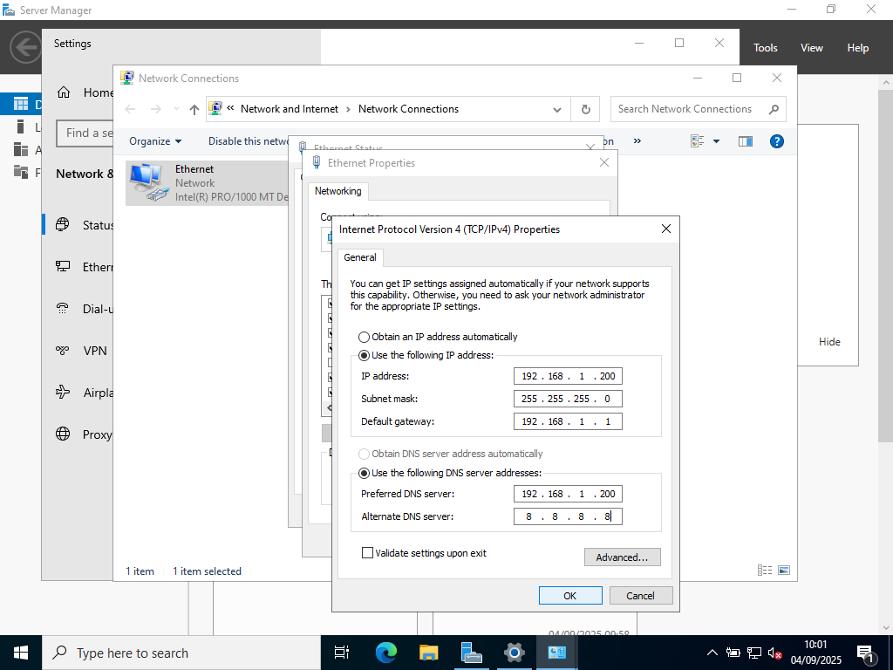
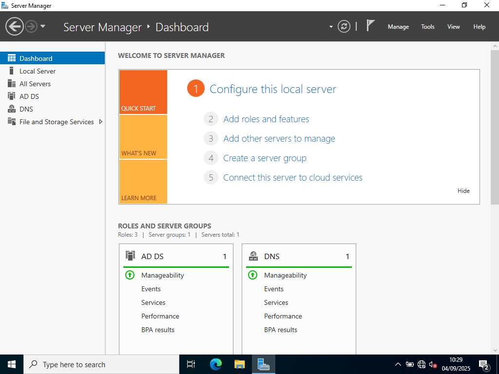
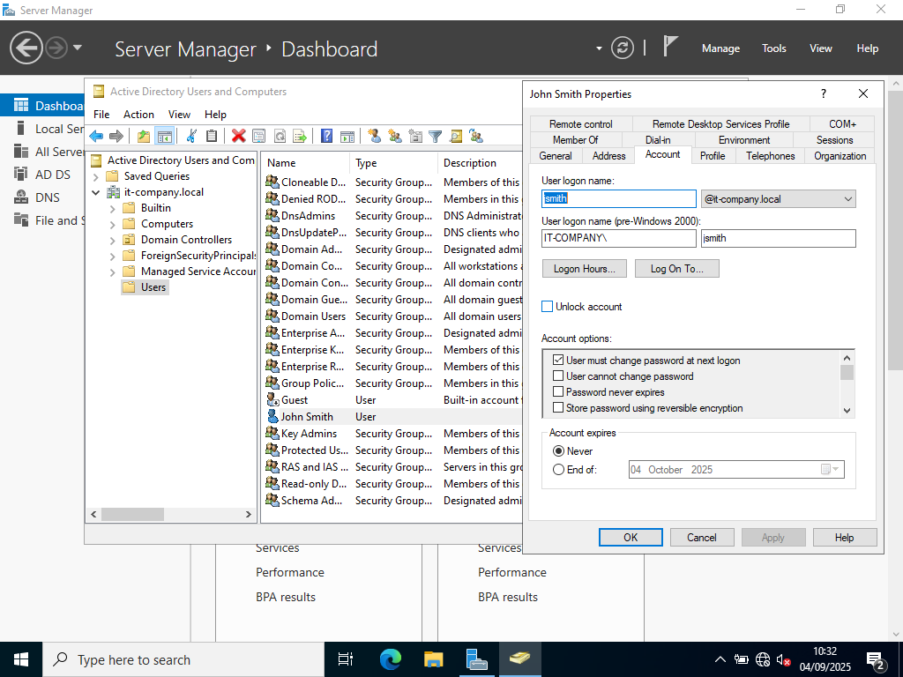

# Active Directory lab write up

## Purpose

One of the most common roles for a Windows Server to play on a network is an Active Directory Domain controller. This allows you to create and manage users on a network, and is very common in professional environments. I wanted to experiment with this software, and learn how to perform tasks that I would be required to do at an IT support job.

## Technology used

* Oracle Virtual Box 7.1.12

I used this software to run all the machines in this lab, as I did not have the physical hardware available to run them all.

* Windows Server 2022

I used this version of Windows Server as it was the most recent version I could find. This is the required software to install a Active Directory role.

* Windows 10 Pro Edition

I used this for my client machine, as this was the most cost effective edition that could also join a local Active Directory domain, as the Windows 10 Home edition cannot be used with Active Directory.

## Setting a static IP address

When you are using a windows server on a network, you want it to remain on the same address for its entire lifespan, that way you will always know where to point your client machines. The easiest way I found to do this was to set a static IP address for the machine.

## Assigning the roles to the server

In order for this server to function correctly, we need to assign the Active Directory Domain Services role to it, you can do this through the server manager. In order for the Active Directory to allow you to add machines and users across the network, you will also need a DNS (Domain Name Service) server too. I decided to install both of these roles on the same server, as this will allow me to save space in my virtual lab and still give the functions required. I was required to give my new domain a name, and I went with "it-company.local". This will be the domain in which I manage the users and machines. In order to use the Active Directory services, you need a 'Domain Controller' server present in the system, you can promote a windows server to this role, and I chose this server.

## Creating a user

Now I had the roles installed on this server, I needed to create an account to use it with, I chose to create an account for my fiction sales worker 'John Smith'.

## Adding a machine to the domain

Now that I had created a domain and a user account, I needed to add a machine for John Smith to use when he is working. First I had to point the machine to the domain, and I did this by editing its IPv4 address so it now used the server as a DNS server. When adding the machine to the domain, my John Smith account did not have the neccesary privileges to add a new client machine, so I used my domain administrator account to do so.

## Logging in to my new domain with a user account

The account was created, and the machine setup, now all I needed to do was log it in for the first time, to check that the account functioned correctly.

## Creating a sales group

The easiest way to organise your users in Active Directory, is to assign them groups based on their respective departments. As I only have one employee for this lab so far, our sales employee John Smith, I need to create the 'Sales' group to add his user to.

## Adding user to group

Now our 'Sales' group has been created, we can add John to it. This will allow us to set permissions for the group, and send out messages to everyone in sales at once.

## Restting password

As my employees are only human, there may come a time when they forget their passwords and will require my help in order to access their accounts again. Luckily I have the way to do this, in the user accounts and machines section of the Windows Server Administrative Tools, I was able to reset the password for John Smiths account.

Overall, this lab was incredibly helpful in helping my understand the following topics on a level I can now comfortably use them:

* Windows Server roles
* Basic networking (IP/DNS)
* Account management
* Adding machines to a domain
* Resetting user passwords

I am pleased with how this lab went for me, however there are some things I feel I could improve upon next time I create a Active Directory lab environment:

* Connecting to the server via Remote Desktop Protocols

I performed all the tasks on the server, with the virtual machine open, which does not really simulate how I would connect to and modify a server in the real world. As I was setting this machine up to learn how to use these technologies, I feel like this was okay for this lab, but in the future, I will use a client machine, and connect to the server remotely, to simulate a 'headless' server setup.

* Using the default 'Administrator' domain account

This is not the most security conscious way to perform admin tasks on a Windows server. But as this machine was being used on a internal network, with no connection to the outside world, I felt that using any extra accounts was unneccessary. In the future, I will always create a secure account and add this to the Admin group, and disable the default admin account, ensuring that attackers cannot leverage the default account to enter my system. 
