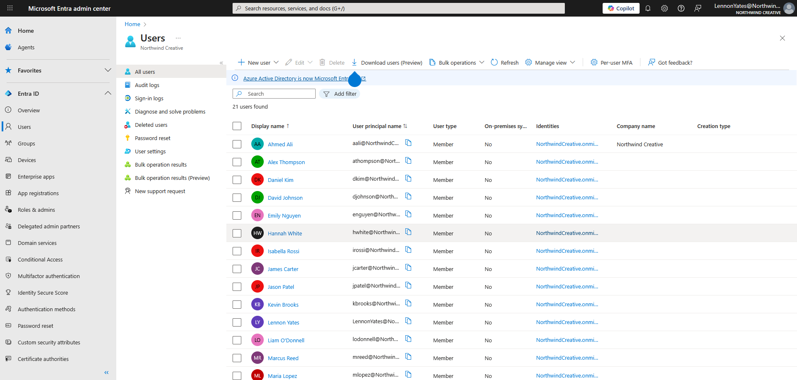
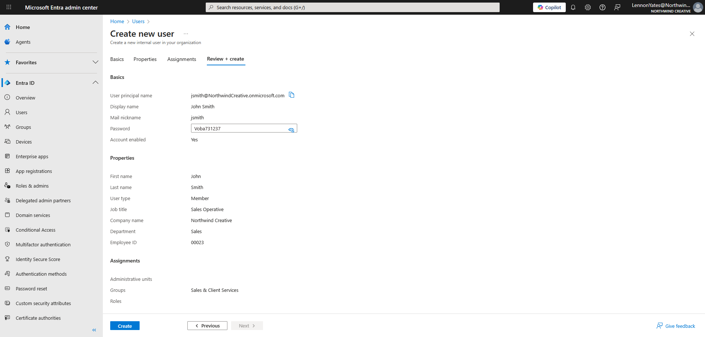
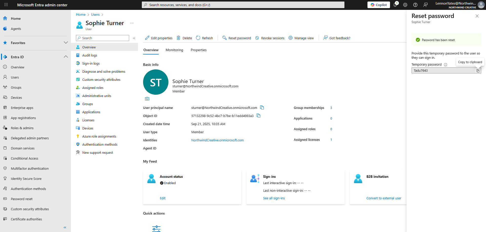
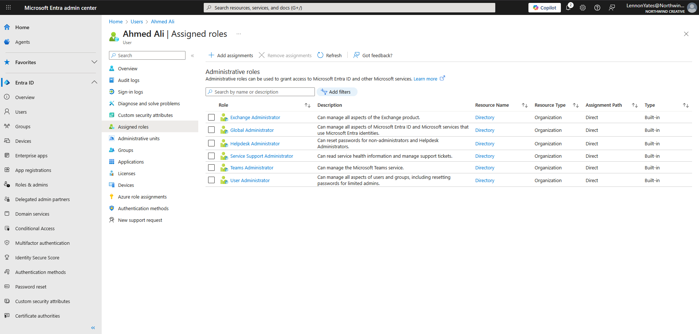
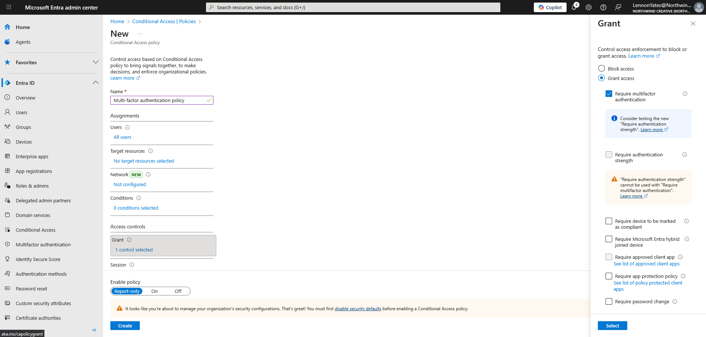
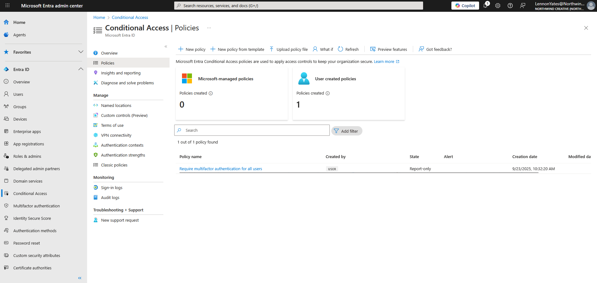

# EntraID lab write up

## Purpose

Building on the tools that I use in a IT support environment from my M365 lab, I have started learning the EntraID software. This software manages user authentication. In this lab, I chose to simulate some basic task such as user creation, resetting passwords, enabling multi-factor authentication (MFA), and assigning roles to users.

## Technology used

* Microsoft EntraID

This is a technology this is widely used in business environments, especially when you have have to manage multiple logins over multiple platforms. This software allows you to manage these credentials, as well as login credentials for all of your users. I chose to set up this cloud based lab to demonstrate my ability to use this technology, and simulate the tasks I would be expected to perform in an IT support role. I also wanted to experiment with this platform, as I am interested in cloud based computing, and this allowed me to learn and refine skills in this technology.

## Defining the users

For this lab, I needed some users to work with. I already had a domain set up for my fictional business 'Northwind Creative' so I imported these users from M365 into EntraID. I did this by:

* Signing into my M365 admin account in the EntraID cloud portal.

This imported all my users and their credentials to start using in EntraID.

## Adding a new user

Now I have all my users in place, I can start performing common tasks with this technology. The first task I chose was to create a new user. I did this by creating a new Sales Operative 'John Smith'. Here are the steps I took to complete this task.

* Logged into the EntraID admin panel.
* Selected 'Add user' from the admin panel.
* Entered the username for the user, following common naming conventions (first initial and last name).
* Entered the details for the employee (first name, last name, employee id number, job title).
* Generated password for account.
* Enabled MFA for this account.
* Added user to relevant group (in this case, the sales and client services group).

## Resetting user password

One common task you will be expected to perform in EntraID will be resetting a user password. Here are the steps I go through in order to reset a user password.

* Confirm the employee identity (using security questions, or asking for the employee ID number).
* Log in to the EntraID admin panel.
* Select 'Users' from the admin panel.
* Select the required user.
* Click 'Reset password' at the top of the user profile screen.
* Generate new password, and give this to the employee, ensuring they can now log in to the system.

## Assigning roles to a user

Once a user has been created, or perhaps they need more access to the system if they have received a promotion, or they have new job responsibilities. I needed to assign my IT manager the access roles in order to perform their daily tasks. You can achieve this easily in EntraID by completing the following steps:

* Log in to the EntraID admin panel.
* Select 'Users' from the admin panel.
* Select the user you wish to assign the role(s) to.
* On the user profile page, select 'Assigned roles' on the right hand side.
* Select 'Add assignments' at the top of the Assigned roles page.
* Select the necessary roles for this user.
* Click 'Add' to confirm your changes.
* Refresh the profile to confirm changes have taken place.

## Using conditional access policies

To keep up security across all accounts on your network, you may want to set up conditional access policies, this lets you require all users to have the same level of security in order to log in to your network. In this lab, I chose to require MFA from all accounts in order to sign in. Here are the steps I took to set this up:

* Log in to the EntraID admin panel.
* Select 'Conditional Access' from the left hand navigation pane.
* Select 'Policies' from the navigation menu of the conditional access panel.
* Select 'New policy'.
* Enter a name for this policy.
* Select the users this affects.
* Select the apps for this policy to affect.
* Select the grant conditions for this policy (in this case, requiring MFA).
* Click 'Create'.
* Click 'Refresh' on the conditional access panel to ensure the changes saved.

## Things I learnt in this lab

This lab was incredibly helpful in learning how this technology works. It also gave me some insight into the differences between user accounts in a cloud based system, and user accounts in on-premises systems (like Active Directory) here are the skills I learnt and built on for EntraID in this lab:

* EntraID user creation.
* EntraID password resets.
* Assigning roles to users.
* Importing users from Microsoft 365.
* Creating conditional access policies in EntraID.

## Things I would improve.

I enjoyed creating this lab, and thought overall it went well, following all the best practices and work flows that I could. However, I feel there are some areas where I could make improvements in future projects:

* Creating security groups

 I am currently using groups to sort employees into their work departments. This means I have to individually assign all roles and permissions to users. This isn't the best practice for configuring these permissions, and in future labs, I will create different security groups for the departments that require them, like creating a sg-sales group, and adding the sales management team, allowing them to upgrade and install applications on their systems.

* Choosing strength of MFA policy

 I have created a policy requiring users to use MFA, but have not specified how strong the authentication needs to be. In future I would change the required strength of this policy to ensure that employees used strong methods of authentication, such as a hardware authentication key, or the Microsoft Authenticator app.

