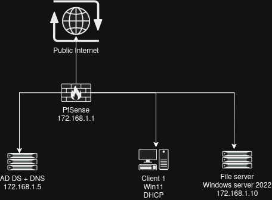
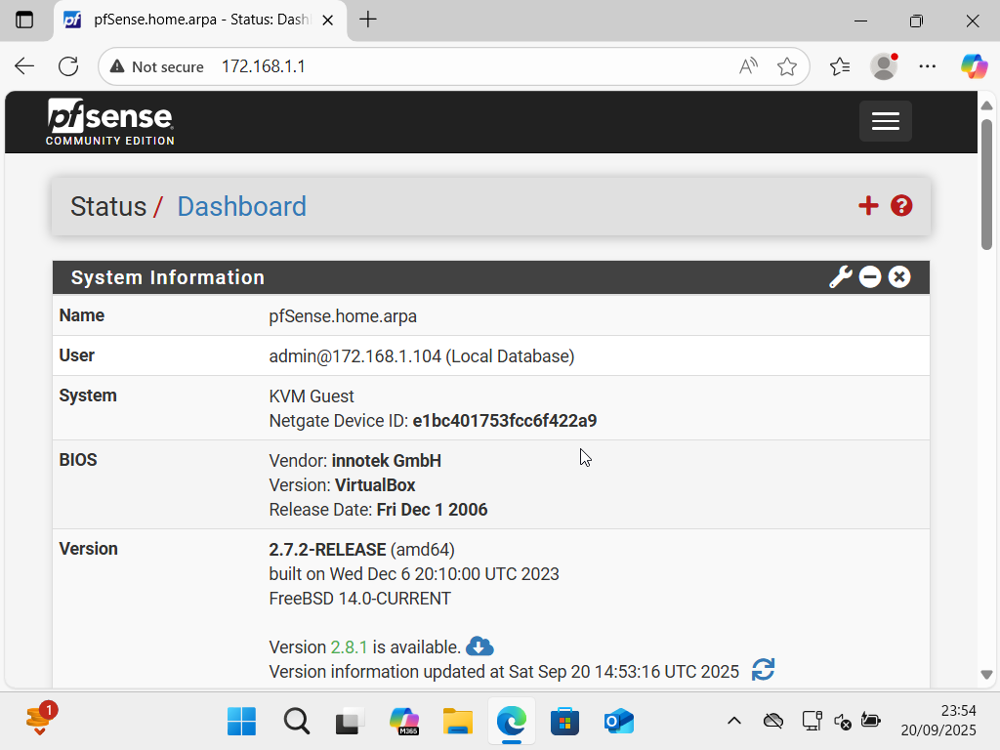
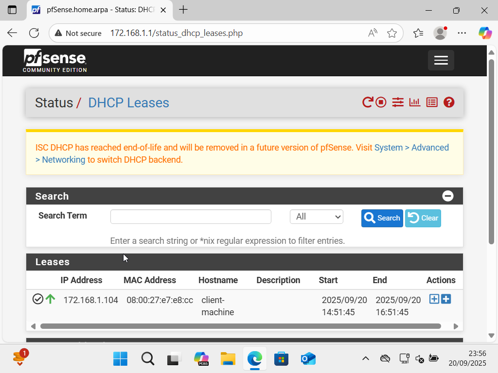
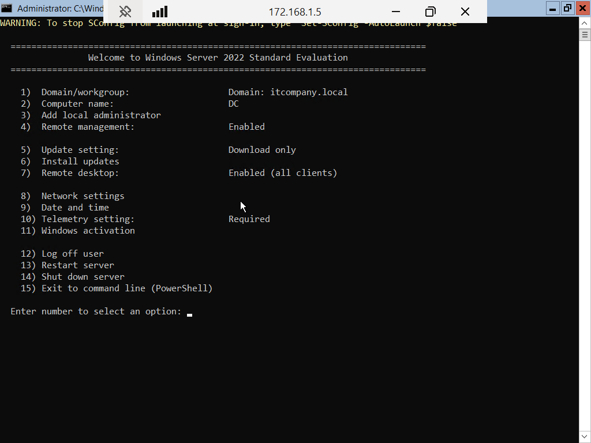
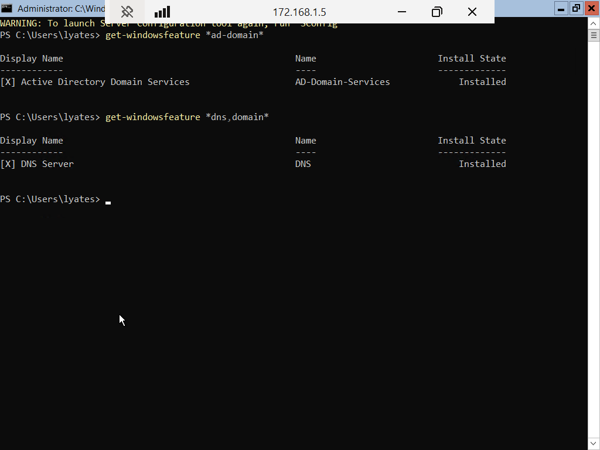
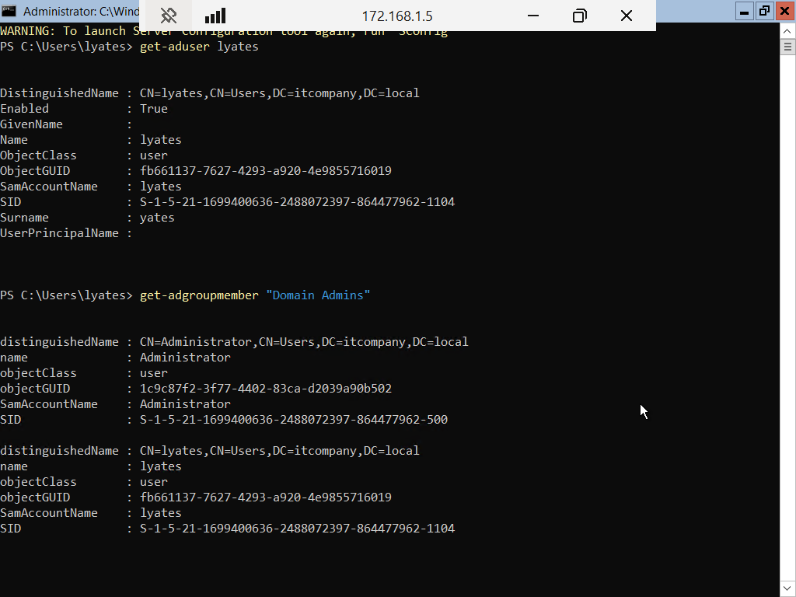
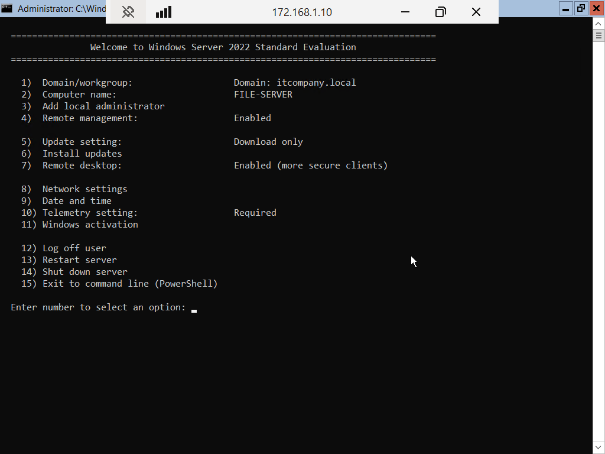
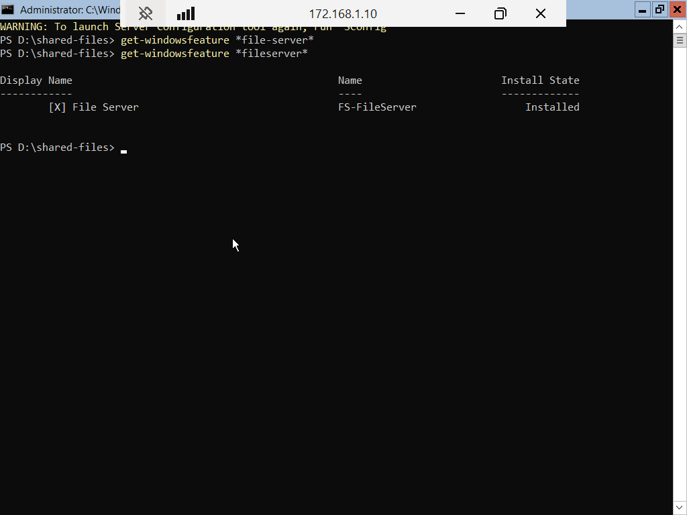
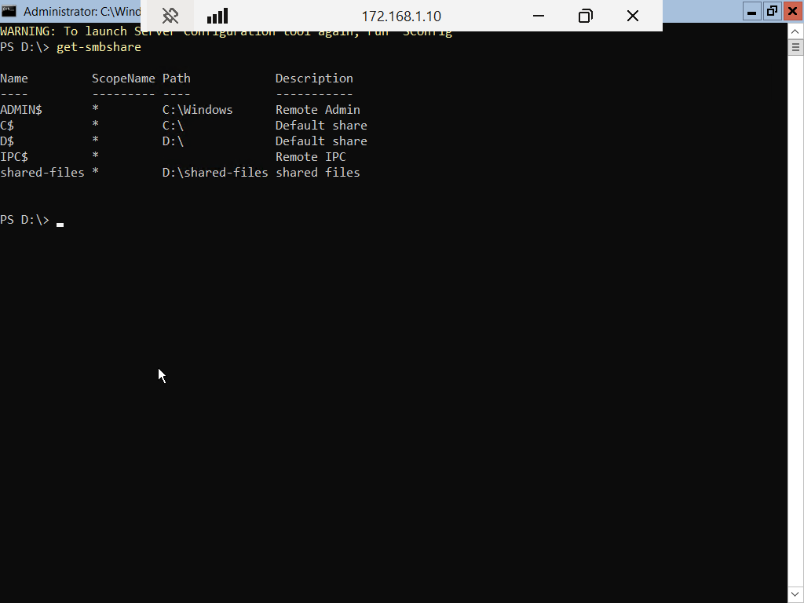
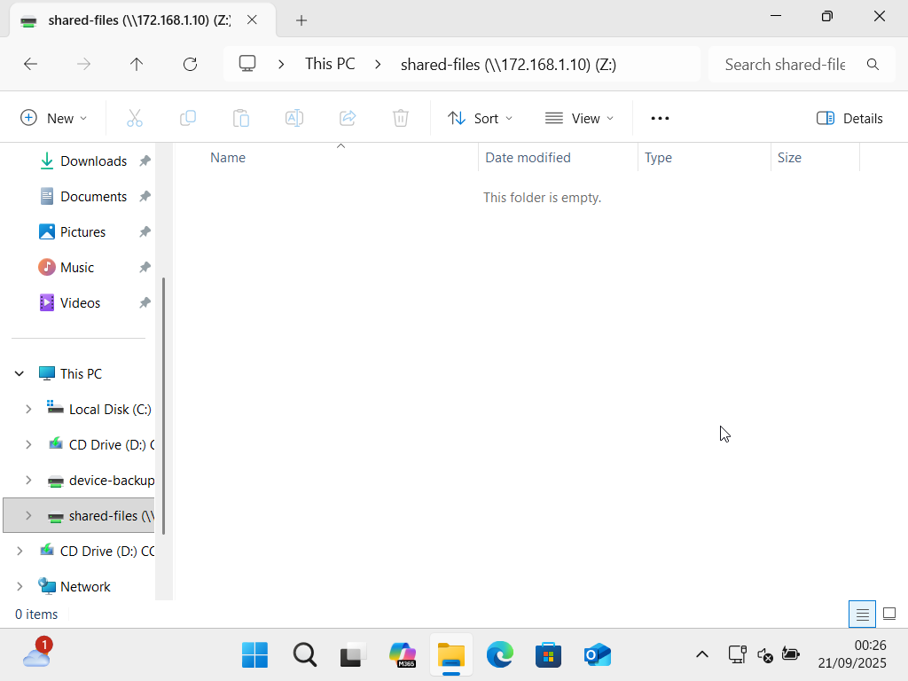

# Networking lab write-up

## Purpose

Networking is an important skill in IT support, as if you can understand how to configure networks, then you can use these skills to assist you in your troubleshooting. I wanted to showcase my ability to set up and use common networking devices that you will see day to day in any IT job.

## Technology I used

* Oracle VirtualBox 7.2.2

I used this software to run the virtual machines for this lab. I chose to use virtual machines, as it still displays I understand the concept of how to set-up and use the machine, needing to source a lot of physical hardware.

* Windows server 2022 server core

I chose to use the server core version of Windows server 2022 for this lab. I have previously only used the Desktop Edition of Windows server, and feel like this is not representative of how I will interact with the machines in the working world. This allowed me to start working with tools like Powershell. This is also the software required to assign the roles I needed to build this lab.

* Pfsense firewall

I chose to use a Pfsense firewall for this lab, as I wanted to connect all of my machines together on a local network, allowing me to put them all on a Active Directory domain, but I can also securely connect to the public internet, emulating a real world network.

* Windows 11 Pro edition

I chose to use this software for my client machine. I chose the Pro edition, as this allowed me to connect to servers via Remote Desktop Connection, and to connect this machine to the Active Directory server, allowing me to log in with my AD credentials.

## Network topology

As this network contained several devices on the network, with a lot of IP addresses to remember, a plan of the network was essential to have here. Network maps are commonly called "topologies" and I drew up a very basic one, so I could visualize the connections for this network.

## Firewall

The first device to set-up for this lab was the PfSense firewall, this would allow all my devices to connect to each other, and also allow them to connect to the public internet. Here are the steps I went through to set up this machine:

* Install PfSense software on machine.
* Assigned the network adapters.
* Set static ip for LAN adapter from the network topology.
* Set the DNS server address.
* Changed admin credentials from default to increase device security.
* Configure DHCP range.
* Configured firewall rules.

## Active Directory DS & DNS server

The next device for me to set-up on this network was the Active Directory server. This will allow me to create accounts and use these credentials to log in to the machines on my network. Here are the steps I went through to set up this machine:

* Installed Windows server 2022 server core.
* Set the static ip for the machine from the network topology. 
* Enable remote desktop on this machine.
* Assigned the Domain Services role.
* Assigned the DNS role.
* Promoted this server to Domain Controller.
* Set the DNS address to this servers ip address, pointing it to the domain.
* Created a Active Directory user for myself.
* Promoted this user to the 'Domain Admins' group, allowing me to connect new machines to the domain.

## File server

The last server for me to set up on the network was the file server. I chose this type of machine, as it is a common machine you will find in a IT environment, giving lots of people access to different files they may need day to day. Here are the steps I took to set up this machine:

* Installed Windows server 2022 server core.
* Set the static ip for this machine from the network topology.
* Set the DNS address of the machine to the ip of the DNS server.
* Added the machine to the domain.
* Enabled remote desktop connection to this machine.
* Installed the file server role.
* Added another virtual hard disk to the virtual machine.
* Configured this disk in diskpart for use with the operating system.
* Created the shared directory (D:\shared-files)

## Client machine

Finally, I wanted to create a machine to simulate how I would access these machines in the real world, as often you can't just connect a keyboard directly to a server and set it up like this. I chose to set up a Windows 11 pro machine, as this is most likely the type of machine I will use in a IT support environment, and I needed the pro edition, as the home edition does not allow you to connect to remote machines, or allow you to connect to a domain. Here are the steps I went through to set-up this machine:

* Installed Windows 11 Pro.
* Set the DNS address to the DNS servers ip from the network topology.
* Added the machine to the domain.
* Used the PfSense WebUI to connect and configure the firewall and DHCP server.
* Used Remote Desktop Connection to connect to the Active Directory server to configure the roles and create my user.
* Used Remote Desktop Connection to connect to the File server, configure the roles and created my shared directory.
* Added the shared directory as a Mapped Network Location.
* Tested connectivity across the network.

As you can see from all of the screenshots, I accessed all the machines remotely.

## What I learnt from this lab

This lab was challenging, as it tested a lot of the skills I have built up, but it was also incredibly fun, and helped me learn a lot:

* Setting up and configuring a firewall.
* Using the powershell console to set up and configure Windows server machines.
* Configuring different parts of a network (DHCP/DNS/Static IP).
* Using remote access tools.
* Mapping a network drive to a Windows machine.
* Troubleshooting DNS address (initially the client machine could not join the network, and I found it was trying to assign the DNS server via DHCP, once I changed this to static, it worked perfectly.)

## What I would do different in the future

There are several skills I would like to develop in order to make a lab like this easier next time:

* Create powershell scripts to automate server set-up.
* Use the built-in firewall for added security.

